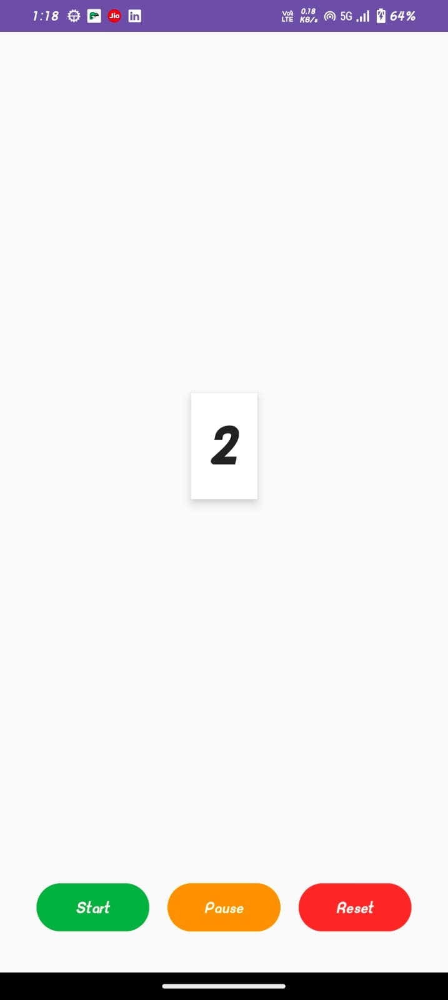
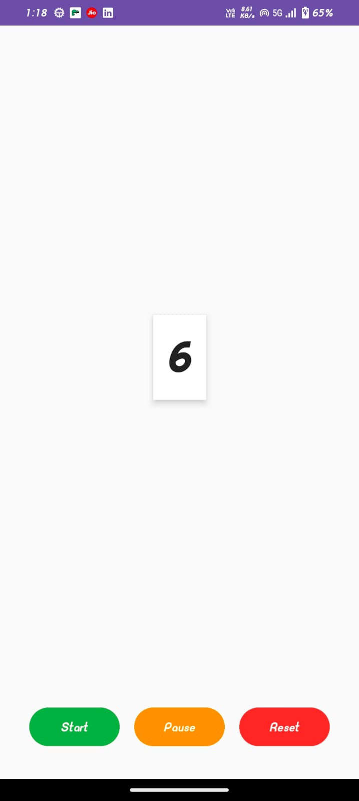

# ⏱️ Stopwatch App (MVVM + Coroutines)

A simple Stopwatch Android App built using MVVM architecture and Kotlin Coroutines.
The app demonstrates how to run background tasks with coroutines while keeping UI updates lifecycle-aware.

# 🎯 Learning Goals

Understand MVVM pattern (View + ViewModel separation).

Use Coroutines to update the stopwatch every second.

Manage app state with Start, Pause, Reset buttons.

Keep stopwatch running properly across configuration changes.

# 🛠️ Core Components

MainActivity (View) → Handles UI, buttons, and observes stopwatch time.

StopwatchViewModel (ViewModel) → Contains coroutine logic for counting time & exposing state.

Coroutines + LiveData → Update the stopwatch counter every second in a lifecycle-aware way.

# 📂 Project File Structure

StopwatchApp/

│

├── MainActivity.kt          # UI layer, observes ViewModel

├── StopwatchViewModel.kt    # Holds stopwatch state + coroutine logic

└── res/layout/activity_main.xml   # Layout (buttons + counter text)

# 🚀 Features

✔ Start the stopwatch → time begins incrementing every second.

✔ Pause → time freezes but can be resumed.

✔ Reset → stopwatch resets back to 0.

✔ UI automatically updates from ViewModel.

# 🔄 App Flow

- Start Button → Launches a coroutine in ViewModel → increments counter using delay(1000L).

- Pause Button → Cancels coroutine job → freezes stopwatch.

- Reset Button → Cancels coroutine + sets counter to 0.

- LiveData → Observed in MainActivity → updates UI instantly.

# 📸 Demo Screens

### ON START

### ON PAUSE

	
	
# 🧑‍💻 Tech Used

Language: Kotlin

Architecture: MVVM

Concurrency: Kotlin Coroutines

State Management: LiveData

UI: ConstraintLayout

# 🧠 What I Learned

How to run background tasks with coroutines in ViewModel.

Managing coroutine jobs & lifecycle (viewModelScope.launch).

The importance of separating UI (Activity) from business logic (ViewModel).

How MVVM + Coroutines work together in real-world apps.

# ▶️ How to Run

Clone the repo  https://github.com/suhaniranka006/StopWatch_with_Coroutines.git

Open in Android Studio.

Run the app on emulator/device.

Play with Start, Pause, and Reset buttons 🚀

# 🔮 Future Enhancements

Add Lap functionality.

Format time into HH:MM:SS.

Use StateFlow instead of LiveData.

Add unit tests for stopwatch logic.
